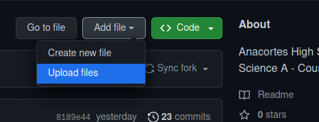

## AP Computer Science A

Monday, March 20, 2023

# Unit 10, Lesson 04: Sorting Intro

## Warm-up: HOWTO turn in Homework

Now that you've completed it, (right???):

### Option A: Within your Codespace

If you have been working within a Codespace.

Use [VS Code Version Control](../git/README.md).

### Option B: Upload to GitHub

If you have been working anywhere other than a Codespace

Visit your GitHub repository and to the left of the green button, Add file > Upload file.


## Return Bell Ringer 6A

I found a red pen! Y'all mostly rung all the bells. Well done! Of those who missed one, it was probably that boolean logic question.

We will review boolean logic in our "study for the AP exam" weeks ahead.

If you want an explainer now, [see here](booleans.md).

## The Week Ahead

This week we have all the days! With all those days, we'll:

- explore sorting 🃏 and searching
- have a couple more "bell ringer" mini-quizzes
- work on a mini-lab to sort words
- code some homework
- And then...

### Unit Exam on Friday!

- ~10 Multiple choice questions of the form: "what does this recursive function do?"

- Free response questions like:
  - Write an iterative version of this recursive function.
  - What are the parts of this other recursive function? (Hint: review those 3 questions.)
  - Something-something about sorting. (Let's learn it first.)

### Recursion on the Exam

You don't have to write recursion on the exam. Instead, you have to understand what a recursive function will do.

Besides being poorly named, what does this function call print? `potato(32768)`

```
public static void potato(int n) {
    System.out.print(n % 10);
    if (n / 10 != 0) {
        potato(n / 10)
    }
}
```

Is this function equivalent? What will it print? `yam(65536)`

```
public static void yam(int n) {
    if (n / 10 != 0) {
        yam(n / 10)
    }
    System.out.print(n % 10);
}
```

How do these functions demonstrate the three questions about recursive functions?

## Guest Speaker: Henry Holtgeerts

What will he tell us? I'll find out too!

## Sorting

As you might imagine, sorting things is rather important in computer science.

Let's explore some algorithms. I brought cards! Today we'll just sort them, without recursion:

- [Bubble Sort](https://en.wikipedia.org/wiki/Bubble_sort)
- [Insertion Sort](https://en.wikipedia.org/wiki/Insertion_sort)
- [Selection Sort](https://en.wikipedia.org/wiki/Selection_sort)

Java implementations of these are in [Scramble.java](Scramble.java).

Here are some [lovely visualizations](https://www.cs.usfca.edu/~galles/visualization/ComparisonSort.html) we can watch in the meantime.

What sort does Java use? [TimSort](https://en.wikipedia.org/wiki/Timsort) is a hybrid of merge sort and insertion sort. (We will learn Merge sort tomorrow.)

## Homework!

Due Tuesday, March 21, 2023, as class begins. Commit an updated `Scramble.java` to your GitHub repo.

(We will discuss `PiDay.java` homework tomorrow.)

In order to continue sorting, we should probably un-sort our arrays. Let's implement a shuffle!

Please review: [Fisher-Yates shuffle](https://en.wikipedia.org/wiki/Fisher%E2%80%93Yates_shuffle)

Within [Scramble.java](Scramble.java) is an unfinished method `shuffle`. Please finish it with an implementation of Fisher-Yates, or the [modern algorithm (Durstenfeld)](https://en.wikipedia.org/wiki/Fisher%E2%80%93Yates_shuffle#The_modern_algorithm). Pseudo-code of the latter is copied here:

```
To shuffle an array a of n elements (indices 0..n-1):
for i from n−1 downto 1 do
     j ← random integer such that 0 ≤ j ≤ i
     exchange a[j] and a[i]
```

Note: I am well aware that with a bit of Googling you can find a solution. I copy code off the Internet all the time! That's what the Internet is for, isn't it?

Here's a fine [StackOverflow](https://stackoverflow.com/questions/2450954/how-to-randomize-shuffle-a-javascript-array), with JavaScript solutions. The key is that you should strive to _understand_ code you use. I suggest trying to code it yourself a bit, first. And then, by all means, feel free to compare what you've done with something online, and self-correct any bugs.

A final nag: Please read "[Hands-On, Experimental Computer Science](https://inventwithpython.com/recursion/chapter0.html#calibre_link-244)" from the intro to the recursion book. As with "coding together" last week, typing out the code you copy will help you learn far better than copy-pasting blocks of code.
